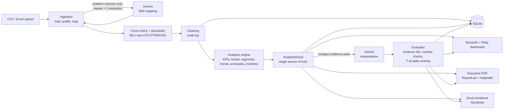

# AI-Powered Marketing Intelligence & Automation Platform

> **An AI-powered Marketing Intelligence and Decision Support Platform that automates the journey
> from raw marketing data to verified analytics, AI-assisted interpretation, interactive
> visualization and executive reporting.**

## The problem

Marketing teams export campaign data from Google Ads, Meta, CRMs and shop systems, then spend
hours cleaning it in Excel, rebuilding the same charts and writing the same slides. The numbers
are often wrong in quiet ways: ratios averaged instead of recalculated, reach added up across
days, a "Total cost" column mistaken for ad spend. AI chat tools make this worse when they are
asked to calculate: they produce confident numbers that nobody checked.

## What This Platform Does

Upload a CSV or Excel export and, with no manual chart building:

- **Profiles and maps the file.** Python rules map the columns they are sure about. Google Gemini
  maps the remaining problem columns (sending only column names and a few example values).
  Every mapping shows who decided it (rule, AI or you) and why, and you can change any of them.
- **Checks the mapping against the file's own maths.** If the file has its own CPC, CTR or ROAS
  columns, they are recalculated from the mapped fields. A match marks the mapping "verified";
  a mismatch is flagged before any analysis runs. Implausible totals (more leads than clicks,
  ROAS above 50x, spend on organic channels) are also flagged.
- **Cleans the data with a full audit log**: duplicates, summary rows, text numbers, Indian and
  European number formats, day-first dates, label typos and impossible values. Missing values
  stay missing (shown as N/A), never 0.
- **Calculates every KPI deterministically** in Python: ratios are always recalculated from
  totals, and reach is never summed.
- **Runs deep marketing analytics**: campaigns, channels (paid vs owned), funnel, segments,
  geography, products, trends, seasonality, and anomaly detection grouped into incidents ranked
  by ₹ impact.
- **Interprets the results with Gemini**, using only a compact evidence pack. Every AI statement
  must cite evidence. Every number it quotes is checked in code. Recommendations are ranked by
  "₹ at stake", which the app calculates, not the AI.
- **Produces three outputs from one analysis result**: an interactive Streamlit dashboard, an
  executive PDF and an analytical Excel workbook, with identical numbers in all three.

New in v2.0 (Decision Intelligence): from "what happened" to "are we on track" and "what next":

- **Insight-driven charts**: titles that state the takeaway, KPI sparklines, one colour per channel
  everywhere, channel → campaign drill-down and incident markers on trend lines.
- **Profitability**: gross margin, break-even ROAS and contribution per campaign and channel, each
  judged against its own margin.
- **Targets vs actual**: a scorecard with On Target / Within 10% / Off Target, by channel and month.
- **Budget pacing and forecast**: monthly budget use with a projected month-end, and an 8-week
  forecast shown as a range with its past error.
- **Scenario planner**: diminishing-returns curves per paid channel, the cost of the next
  conversion, and budget moves with honest ranges and guardrails.
- **Basic and Professional views**: the same numbers in plain sentences with green/yellow/red cards,
  or in full analyst detail.
- **Knowledge-base column mapping**: headers from 16 sources, context rules and value patterns;
  anything still open goes to Gemini fresh for each new column layout.
- **Smarter AI recommendations**: budget advice follows the cost of the next conversion,
  profitability and pacing, with extra evaluator checks (capacity, underspend logic, wording).

## Version roadmap

| Version | Status | Contents |
|---|---|---|
| **v1.0 · Foundation** | Released | Upload and auto-mapping, data cleaning, verified KPIs, channel, campaign, funnel and segment analysis, incident detection, AI insights, PDF and Excel reports. |
| **v2.0 · Decision Intelligence** | **Current** | Insight-driven visualisation, profitability and break-even analysis, targets, budget pacing and forecast, scenario planner, Basic and Professional views, knowledge-base column mapping and smarter AI recommendations. |
| **What I'd Build Next** | | Customer lifetime value and cohorts, multi-touch attribution, live connections to ad platforms, scheduled reports and alerts, team workspaces. |

The last row lists ideas, not promises. The version number comes from `APP_VERSION` in `config/settings.py`.

## Architecture



## Technology stack

| Layer | Technology | Responsibility |
|---|---|---|
| Input | Excel / CSV | User-provided marketing data |
| Programming | Python | Core application and automation |
| Data processing | pandas | Profiling, cleaning, transformation |
| Field matching | rapidfuzz | Synonym and fuzzy header matching |
| Database | SQLite (SQL) | Datasets, runs, clean records, results, AI cache |
| AI | Google Gemini API (`google-genai`), Pydantic | Mapping help and interpretation, validated structured output |
| Web application | Streamlit | Interactive application and dashboard |
| Visualization | Plotly (dashboard), matplotlib (PDF charts) | Charts from the same tables and theme |
| PDF | ReportLab | Executive report |
| Excel | XlsxWriter | Analytical workbook with real numbers and formats |
| Testing | pytest, pytest-cov | about 400 automated tests, 94% coverage |

## How the AI layer works

1. **Evidence first.** Python builds a compact evidence pack (at most 18,000 characters, never
   raw rows): overall and paid-media KPIs, data-quality limits, findings, channels, funnel,
   trends, the top incidents and campaigns. Each item has an ID (E01, E02 ...).
2. **Structured output.** Gemini must answer in a fixed JSON structure (Pydantic), with 3-5 key
   findings and 3-5 recommendations. Every statement lists the evidence IDs it relies on.
3. **Hallucination control.** Items citing no valid evidence are dropped. Every figure is
   compared with the cited evidence; a figure that doesn't match is marked "unverified". A
   finding that only restates a Python finding is marked "weak". Budget moves get a "₹ at
   stake" figure (test share × source spend), and all recommendations are ranked by it.
4. **Free-tier protection.** Answers are cached by a fingerprint of the evidence + prompt version
   + model, so the same analysis never costs a second call. There are call budgets per run, per
   day and (public demo) per browser session, plus a fallback model when the main model is
   overloaded. Quota errors are never retried automatically.
5. **Graceful without AI.** Everything except the AI pages works with AI switched off.

## KPI methodology (summary)

CTR = Clicks / Impressions × 100 · CPC = Spend / Clicks · CPL = Spend / Leads · Click-to-lead =
Leads / Clicks × 100 · Lead-to-conversion = Conversions / Leads × 100 · CAC = Spend / Customers
(else / Conversions, and the report says which) · ROAS = Revenue / Spend · AOV = Revenue /
Orders (else / Conversions) · ROI = (Gross profit − Spend) / Spend × 100, only when gross profit
or margin data exists (no margin is ever assumed).

- Ratios are always recalculated from summed totals, never averaged across rows.
- A zero or missing denominator gives N/A.
- Reach is never added up across days or campaigns.

## Setup (Windows)

1. Install Python 3.12 or newer (developed and tested on Python 3.14).
2. In the project folder:
   ```
   python -m venv .venv
   .venv\Scripts\python -m pip install -r requirements-dev.txt
   ```
   (`requirements.txt` holds the app's runtime packages; `requirements-dev.txt` adds the test
   tools.)
3. Copy `.env.example` to `.env`. The app works with AI switched off (`AI_ENABLED=false`). To
   use AI, add your own `GEMINI_API_KEY` and a `GEMINI_MODEL` available to your key in Google AI
   Studio, and set `AI_ENABLED=true`. Never commit `.env`.

## Usage

1. Double-click `run_app.bat` (or run `.venv\Scripts\python -m streamlit run app.py`). The app
   opens at http://localhost:8501.
2. **Upload & Profile:** upload a file, or press **Load Sample Dataset**. The Kalpa sample
   opens its finished analysis instantly.
3. Review the mapping (source, check badge and reason for every column; change anything),
   then press **Run Analysis**.
4. Explore the dashboard pages. Filters recalculate every figure.
5. **AI Insights:** generate an interpretation within the budget (saved insights show with
   "No AI call was used").
6. **Reports:** download the executive PDF and the Excel workbook.

Public demo mode (`PUBLIC_MODE=true`) keeps each visitor's analyses in their own browser session,
limits uploads to 10 MB and AI calls per session, and deletes runs after 24 hours.

## Tests

```
.venv\Scripts\python -m pytest
.venv\Scripts\python scripts\benchmark.py
.venv\Scripts\python scripts\rehearse_deployment.py
```

Tests never call the real Gemini API: `tests/conftest.py` switches AI off and blocks the SDK's
network layer, and a fake client is used instead.

## Project structure

```
app.py                  Streamlit entry point
config/                 settings (thresholds, env), fields and synonyms
ingestion/              loader, profiler, mapper, cross-check, plausibility, validator
processing/             cleaner, transformer, quality log
database/               SQLite connection, schema, repository, queries, housekeeping
analytics/              KPI registry, campaign/channel/funnel/segment/trend analysis,
                        anomalies, incidents, findings, engine (AnalysisResult)
ai/                     evidence pack, prompts, schemas, client, evaluator, cache,
                        field mapping, demo seed
dashboard/              pages, charts, theme, filters, tables, pipeline, demo snapshot
reports/                PDF (ReportLab + matplotlib charts) and Excel workbook
utils/                  number/date parsing and Indian formatting
data/sample/            synthetic "Kalpa Learning" datasets (clean, messy, variants)
data/demo/              finished sample analysis + saved AI insights for the live demo
scripts/                data generator, benchmark, demo refresh
tests/                  pytest suite and fixtures
```

## Limitations

- **Last-click revenue.** ROAS uses the revenue recorded against each campaign, so upper-funnel
  channels (video, prospecting) can look weaker than they are. The app states this wherever
  ROAS drives a conclusion.
- **Shows what changed, not why.** Findings and anomalies show what changed and by how much. AI
  hypotheses are labelled as hypotheses, with a validation step. Forecasts and scenarios are
  ranges from one year of weekly history, not guarantees (no yearly seasonality yet).
- **One file per analysis**, at the grain of one row per date × campaign (optionally ×
  region/segment). Files with other grains still load, but some analyses switch off.
- **Free-tier AI.** Gemini free-tier models can be busy. The app shows a clear message and keeps
  working, and cached insights and the demo seed avoid live calls in demos.
- **Demo storage is temporary** on Streamlit Community Cloud (it resets on restart).
- **Sample data is synthetic** (a fictional ed-tech company), built with realistic but assumed
  channel economics.

## Future improvements

What I'd build next:

- **Customer lifetime value and cohorts:** judge channels by the value of the customers they
  bring over time, not only by first-order revenue.
- **Multi-touch attribution:** position-based or data-driven attribution alongside last-click
  ROAS, so upper-funnel channels are judged fairly.
- **Live connections to ad platforms:** pull Google Ads, Meta and CRM data directly (and combine
  several exports into one analysis) instead of uploading files.
- **Scheduled reports and alerts:** a weekly job that re-runs the analysis and e-mails the report
  and new incidents (tracking outages, CPL spikes) to the team.
- **Team workspaces:** user accounts and a server database (PostgreSQL) instead of per-session
  SQLite for multi-user deployments.

Also worth doing: richer AI evaluation (check the meaning of statements, not only the numbers,
and track AI quality over time) and seasonality-aware forecasts once two or more years of data
are available.

## How this was built

I designed this project end to end: the product specification, the KPI rules, the business
decisions and the review of every stage. I used AI coding tools to help write the code, and
verified the results with a test suite of about 600 tests. Every number in the app is calculated
by Python, not by AI.

## Licence

Copyright (c) 2026 Mayur Jaiswal. All rights reserved. See [`LICENSE`](LICENSE).
